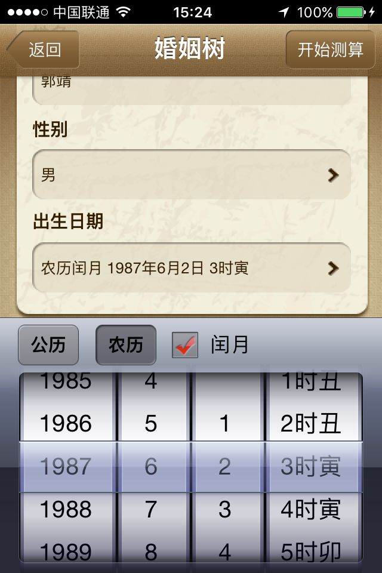

# ZJSDateConvert
用OC实现 公历农历日期转换
 
很久以前项目中的UI
 

 
 
阳历，是以地球绕太阳运动作为根据的历法。它以地球绕太阳一周(一回 归年)为一年。一回归年的长度是365.2422日，也就是365天5小时48分 46秒，积累4年共有23小时15分4秒，大约等于一天，所以每4年增加1 天，加在2月的末尾，得366天，就是闰年。但是4年加1天实际回归年多 了44分56秒，积满128年左右就又多算了一天，也就是在400年中约多算 了3天。
 
阳历闰年规定:公元年数可用4整除的，就算闰年;为了要在400年减去 多算的3天，并规定公元世纪的整数，即公元年数是100的整数时，须用 400来整除的才算闰年，如1600年、2000年、2200年、2400年就是闰 年。这样就巧妙地在400年中减去了3天，阳历规定每年都是12个月，月 份的大小完全是人为的规定，现在规定每年的1、3、5、7、8、10、12 月为大月，每月31天;4、6、9、11月为小月，每月30天;2月平年是28 天，闰年是29天。
 
 
阴历，是根据月相圆缺变化的周期(即朔望月)来制订的。因为古人称月亮为太阴，所以又有太阴历之称，是纯粹的阴历，我国使用"农历"，一般人叫它"阴历"，那是 不对的。农历不是一种纯粹的阴历，而是"阴阳历"。 阴历把月亮圆缺循环一次的时间算做一个月，12个月算做一年。然而月亮圆缺循环一次--一个朔望月，是29天12时44分3秒，比29天多，又比30天少。为方便，阴历 把月份分成大月和小月两种，逢单的月是大月30天，逢双的月是小月29天，一年共是354天。 实际上，一个朔望月并不正好等于一个大月和一个小月的平均数--29天半，而是比29天半多44分2.8秒。所以12个朔望月实际上要比354天多8小时48分34秒，30年就 要多出11天。因此，阴历30年中就要安插11年闰年，每逢闰年就在12个月多加一天。阴历的闰年是355天。这样，阴历每30年中有19年354天，11年355天，平均一 年的长度是354天8小时48分。它的一年比回归年差不多短了11天。3年就短一个多月，17年就要短6个多月了。所以使用这种历时，新年不一定在冬天过，它可以在春 天过，也可以在夏天或秋天过。它的惟一好处就是阴历上的每一个日期都可以知道月亮的形状。 阴历作为一种历法，由于它与农业生产和人们的日常生活不相协调，所以当今世界上除了几个伊斯兰教国家因为宗教上的原因仍然使用外，其他国家一般已经废弃不用 了。 
 
农历，是把朔望月的时间作为历月的平均时间。这一点上和纯粹的阴历相同，但农历运用了设置闰月的办法和二十四节气的办法，使历年的平均长度等于回归年，这样 它就又具有了阳历的成分，所以它比纯粹的阴历好。 现在所有的农历，据说我们的祖先远在夏代(公元前17世纪以前)就使用了这种历法。所以人们又称它为夏历。解放后还仍然叫做夏历，1970年以后我国改称为"农 历"。至于"农历"一名的由来，大概因为由于自古以农立国，所以制订历法必须为农业服务。 农历的历月是以朔望月为依据的。朔望月的时间是29日12小时44分3秒(即29.5366日)，因此农历也是大月30天，小月29天，但它和纯粹的阴历并不完全一样，因 为纯粹的阴历是大小月交替编排的，而农历年大小月是经过推算决定的。 农历每一个月初一都正好是"朔"(即月亮在太阳地球中间，且以黑着的半面对着地球的时候)。有时可能出现两个大月，也可以连续出现两个小月。由于朔望月稍大于 29天半，所以在农历的每100个历月里约有53个大月和47个小月。 农历是基本上以12个月作为一年的，但12个朔望月的时间是354.3667日，和回归年比起来要相差11天左右。这样每隔3年就要多出33天，即多出一个多月。 为了要把多余的日数消除，每隔3年就要加一个月，这就是农历的闰月。有闰月的一年也叫闰年。所以农历的闰年就有13个月了。至于闰哪个月是由节气情况决定的。
 
